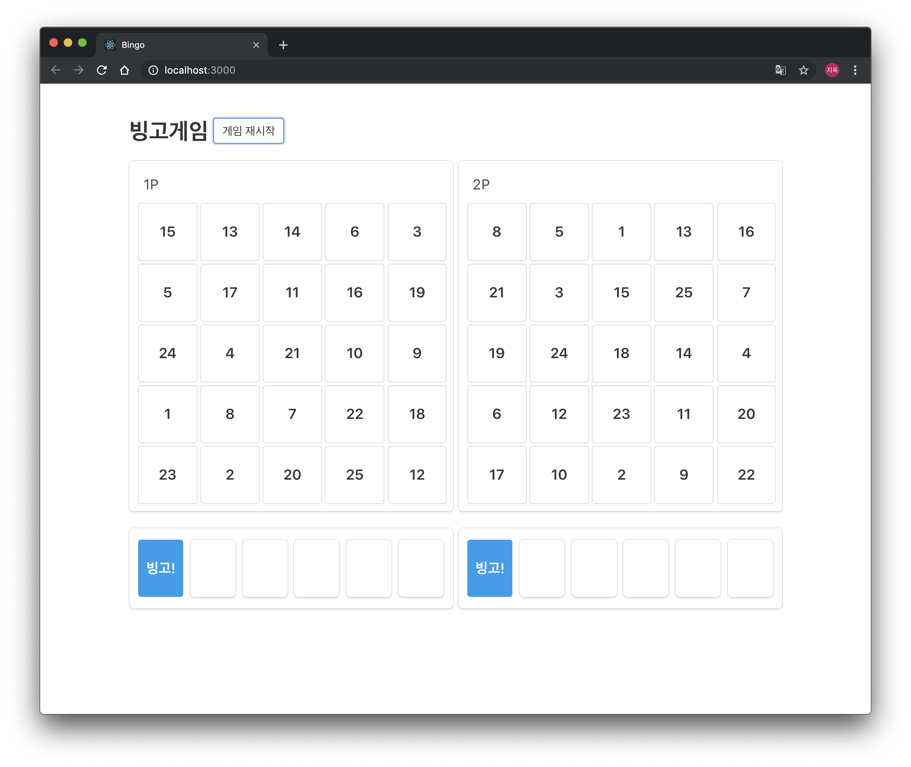
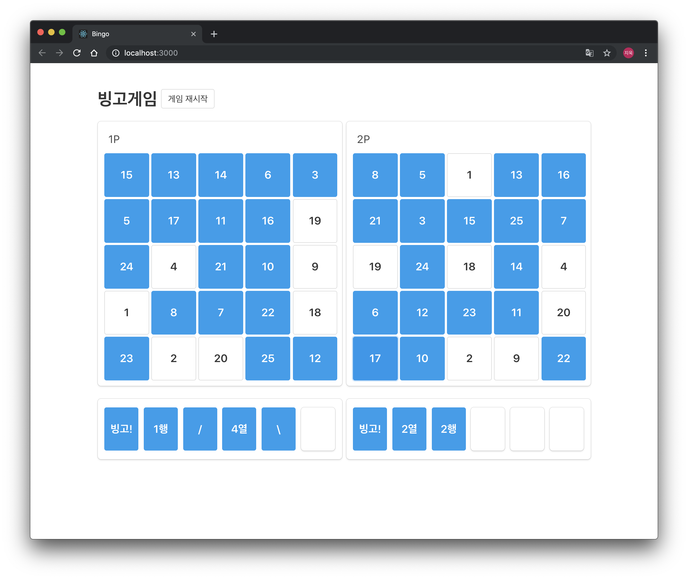

# Bingo App

React-Redux 로 만드는 2인 플레이가 가능한 간단한 빙고게임

&nbsp;

## 0. 로컬 실행 방법

`yarn` 명령어를 통해 의존성 패키지들을 설치해줍니다.

```bash
> yarn
```

`yarn start` 명령어를 통해 서버를 실행해줍니다.

```bash
> yarn start
```

## 1. 사용 기술 및 개발 계획

### 1) 사용 기술

React.js 와 Redux 를 사용해 구현했습니다.

State 불변성 유지를 편리하게 해주는 immutable.js

Array 등의 methods 사용을 위해 underscore.js

약간의 css 사용을 위한 bulma framework 를 사용했습니다.

- react: 16.8.6
- react-redux: 7.0.3
- redux: 4.0.1
- immutable: 4.0.0-rc.12
- underscore: 1.9.1
- bulma: 0.7.5

&nbsp;

### 2) 개발 계획

- 진행 기간 : 2019.05.31 오전 10시 ~ 2019.06.01 오전 10시
- 24 시간의 타임어택을 가지고 진행한 프로젝트

&nbsp;

### 스크린샷





